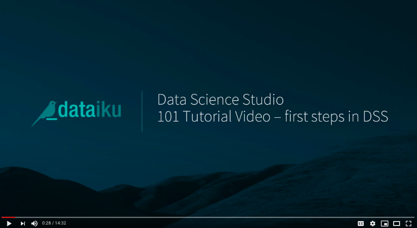

# Data Analytics
## Combining & visualizing data to drive meaningful insights
## Aug 15, 2020
## Authors RIHAD, SAMIRA, SALENA & ISHITA

# Ethics Declarations
## Competing Interests
The authors declare no competing interests

# Rights & Permissions
Open Access This article is licensed under a Creative Commons Attribution 4.0 International License, which permits use, sharing, adaptation, distribution and reproduction in any medium or format, as long as you give appropriate credit to the original author(s) and the source, provide a link to the Creative Commons license, and indicate if changes were made. The images or other third party material in this article are included in the article’s Creative Commons license, unless indicated otherwise in a credit line to the material. If material is not included in the article’s Creative Commons license and your intended use is not permitted by statutory regulation or exceeds the permitted use, you will need to obtain permission directly from the copyright holder. To view a copy of this license, visit http://creativecommons.org/licenses/by/4.0/
