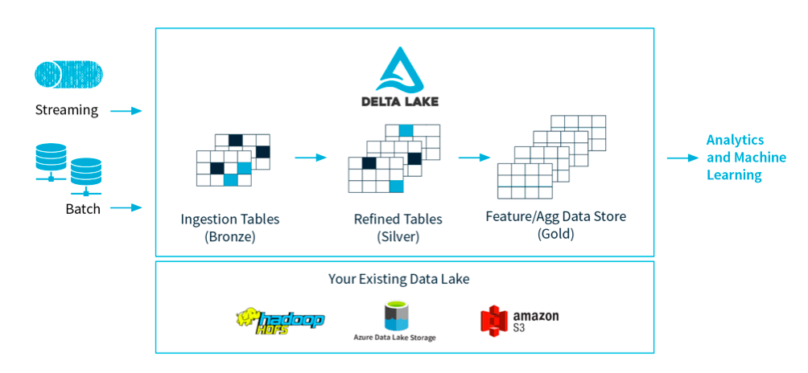
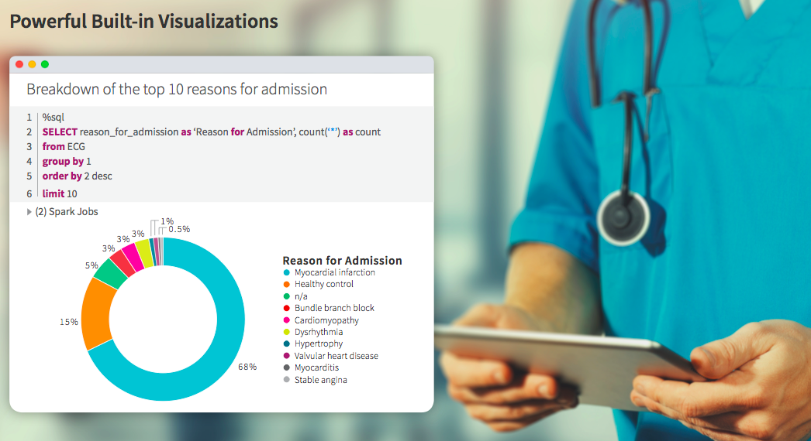
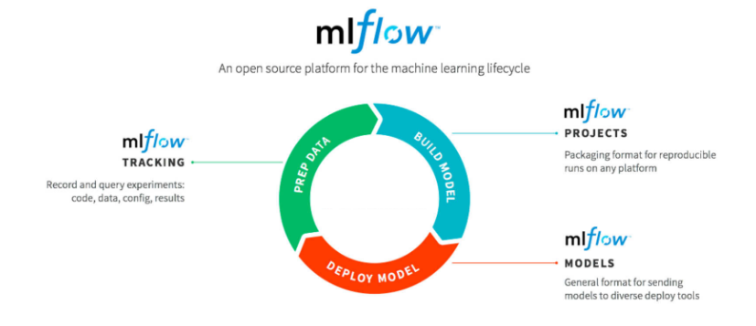

# Analyzing Real World Evidence at Scale
## July 8, 2020
## Authors RIHAD & SAMIRA
> Rihad, a Data Scientist and former head of global fintech research at Malastare.ai, I find fulfillment tacking challenges to solve complex problems using data

*By applying advanced analytics and machine learning to data, healthcare and life sciences firms can deliver on a number of innovative use cases*

## From Molecular to Market
An analytics platform provides the ideal solution for biomedical researchers to tackle the challenges of real-world data analytics. A cloud-based, fully managed platform simplifies data access and data engineering, while fostering a collaborative environment for machine learning driven innovation

### Eliminate Infrastructure Complexity
With fully managed, highly elastic cloud service on both AWS and Azure, infrastructure teams can stop fighting complexity and start focusing on building highly performant, reliable data pipelines for downstream real world data analytics. In a few simple clicks, data teams can launch optimized, auto-scaling Apache Spark clusters in the cloud. No more waiting for infrastructure teams to provision and configure compute resources. Data scientists can start exploring petabytes of real world data in real-time

### Easily Build Reliable Data Pipelines at Scale
One of the most common problems firms face when dealing with massive volumes of real world data across disparate sources is that it can become *unreliable, low quality, and challenging to manage*. Many organizations turn to data lakes to aggregate their big data cost-effectively, but this poses its own challenges. Delta Lake, an open-source storage layer for data lakes, is natively integrated in *Rockwall Analytics*' to provide ACID transactions for big data use cases, including batch and streaming ingests, fast interactive queries, and machine learning. Designed to help data professionals build robust production data pipelines at scale, Delta Lake brings data reliability and performance to your data lakes so you can finally make use of all your real world data

### Innovate Faster with Collaborative Research
In medicine, timing and speed is everything. Data scientists and bioinformaticians using interactive workspace can use their preferred scripting languages, such as R, Python, Scala, and SQL, and libraries, including Tensorflow, Keras, Pytorch, scikit-learn, nltk ML, pandas, koalas etc., to interact with data and accelerate innovation

Collaborative workspaces allow teams to view and edit models in-flight and provide real-time feedback. **Technology is nothing without people to make it great**, and *Rockwall Analytics* ensures that teams can become heroes, by providing a common workspace and tooling for all stakeholders, regardless of skill sets, to collaborate. This eliminates data silos and frees teams to focus on what they do best

Data scientists can turn insights from real world data into powerful visualizations designed for machine learning, such as matplotlib, ggplot, etc. Visualizations can be turned into interactive dashboards that are easily shared with clinicians, research scientists, and decision makers across the drug development lifecycle. Integrates with popular BI tools, including Looker, Tableau, Qlik, and Alteryx, so that existing investments can be fully leveraged. By integrating and streamlining the individual elements that comprise the analytics lifecycle, teams can now innovate with real world data in a matter of days instead of months

### Simplify the Machine Learning Lifecycle
Successfully building and deploying models in a clinical setting can be difficult. Enabling other data scientists to reproduce a pipeline, compare the results of different versions, track what’s running where, and redeploy and rollback updated models, is even harder. MLflow, an open-source framework for managing the complete machine learning lifecycle, is open and extensible by design, and platform agnostic for maximum flexibility. With MLflow, data scientists can track and share experiments locally or in the cloud; package and share models across frameworks; and deploy models virtually anywhere, accelerating time-to-insight and reproducibility in the lab

### Keeping Patient Data Safe and Secure
*Rockwall Analytics* takes security very seriously. Data should be protected at every level of the platform through fine grained access control and deep integration with cloud-provider access control mechanisms. Providers should offers a HIPAA compliant cloud-based platform. An independently audited platform should be compliant with HIPAA security and breach notification rules, including comprehensive technical safeguards covering access, encryption, auditing, and many other stringent controls

### Derive Value from Real-world Data Faster
When adopting new technologies, all vendors promise to lower total cost of ownership, but this can often be an empty promise. *Rockwall Analytics* stands behind the lower-TCO claim with a cloud-native unified platform that requires no expensive hardware, an operationally simple platform designed to help you efficiently manage your costs, increased productivity through automated workflows and seamless cross-team collaboration; and faster processing performance than other analytics products — all of which results in shorter time-to-value

## Conclusion
Delivering on the promise of real world evidence is still in its infancy as many firms struggle to unlock the value embedded in their data. *Rockwall Analytics* offers a path forward by empowering data scientists, engineers, and researchers to work together to apply advanced analytics to their petabytes of real world data and deliver on innovative use cases

