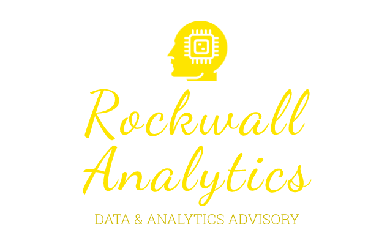

# Asia Private Equity Client
## Investment Banking - Analysis By Rockwall Analytics
## We have been engaged to help drive Profitability Improvement
## Aug 15, 2020
## Authors RIHAD, SAMIRA VARIAWA

Welcome! We’re so excited to have you here with us!

***Rockwall Analytics is naturally curious and we challenge the status quo***

This multi-part task series worked on by our strategy advisors, **RIHAD & SAMIRA** showcase a deep understanding on what ***Rockwall Analytics*** does and helps set you up for success when you decide to engage with us

## Back Story

>Asia Private Equity Client would like to acquire an online gaming company

## Objective

>As part of the preliminary assessment **Rockwall Analytics** have been requested to compile the following information for their investment committee:

* Quick profile of Zeta
* Comparable companies list
* Their associated financial metrics

Rockwall Analytics partners with leaders in business and society to tackle their most important challenges and capture their greatest opportunities. Our diverse, team bring deep industry and functional expertise and a range of perspectives to spark impactful changes through leading-edge management consulting as well as data science, technology and design, and business purpose. We work in a uniquely collaborative model across the firm and throughout all levels of the client organization to deliver results that helps our clients thrive

In this showcase, we share insight into what it’s like to solve meaningful challenges with our diverse and forward-thinking team and how top-tier consultants tackled this multi-part task series

At **Rockwall Analytics** we believe in the power of the elemental. In atoms we discovered the building blocks of all matter, exploding our understanding of the world around us as we peered through microscopes or looked up to the stars. In DNA we unearthed the being blocks of all life, determining the code of our makeup and our links to the world around us. In data points, we capture the behavioural blocks of humanity – ***and it’s only now that we are beginning to fully embrace their potential***. These three breakthroughs of the modern age all deliver one simple lesson: we can neither make sense of the whole without knowledge of the parts, nor harness the elemental units without the power to combine them to create a bigger picture

That’s where we come in. Through data science and artificial intelligence, we make meaning from data like never before. Our solutions make sense of what has happened and what will, could or should be done to re-shape industries and societies around the needs of the people they serve. So, we believe in using data for progress, with great care and responsibility. We believe in better goods, better services, better experiences, and for the benefits of the data age to be fairly shared for a brighter future

**We believe in data powering possibilities**

# Ethics Declarations
## Competing Interests
The authors declare no competing interests

# Rights & Permissions
Open Access This article is licensed under a Creative Commons Attribution 4.0 International License, which permits use, sharing, adaptation, distribution and reproduction in any medium or format, as long as you give appropriate credit to the original author(s) and the source, provide a link to the Creative Commons license, and indicate if changes were made. The images or other third party material in this article are included in the article’s Creative Commons license, unless indicated otherwise in a credit line to the material. If material is not included in the article’s Creative Commons license and your intended use is not permitted by statutory regulation or exceeds the permitted use, you will need to obtain permission directly from the copyright holder. To view a copy of this license, visit http://creativecommons.org/licenses/by/4.0/

## DISCLAIMER

This document contains material provided to the Investment Committee of the Board of Directors (the "Client") of Asia Private Equity. (the "Company") by Rockwall Analytics LLC ("Rockwall") pursuant to the terms of a letter of engagement with the Client, dated as of June 4, 2020 (the "Engagement Letter")

This document, together with any oral or supplemental information provided in connection with this document collectively, (the "materials"), was compiled or prepared on a confidential basis solely for the use of the Client in connection with the Transaction (as define below) and not with a view toward public disclosure under any securities laws or otherwise. The materials must be held by the Client and its directors, officers, employees, representatives and agents in strict confidence and may not be photocopied or reproduced in any electronic, physical or other form and must not be communicated, disclosed or distributed to any other person in whole or in part at any time except with Rockwall's prior written consent

The purpose of this document is to provide the Client with an explanation of the basis upon which Rockwall is issuing a financial opinion letter (the "Opinion") in relation to the proposal by the Company's Chief Executive Office and Chairman, Mr Xi Mai, his investment vehicle, Asia Private Equity, incorporated in the district of Kowloon, Hong Kong, the investment vehicle of the Industrial Bank of China Co. Ltd., and certain other investment funds to acquire all of the outstanding ordinary shares, including ordinary shares represented by Foreign Depository Shares, of the Target (the "Transaction"). This document should be read in conjunction with and is subject to the terms of the Opinion. This document supersedes any previous documents or presentations delivered by Rockwall to the Client in connection with the Transaction

The information contained in the materials was obtained from the Company and other sources. Any estimates and projections contained herein have been prepared or adopted by Company management, obtained from public sources, or are based upon such estimates and projections, and involve numerous and significant subjective determinations, and there is no assurance that such estimates and projections will be realized. Neither Rockwall, its affiliates nor any of their respective directors, officers, employees or agents (collectively, "Rockwall Analytics") takes responsibility for such estimates and projections, or the basis on which they were prepared nor gives any representation or warranty, express or implied, as to; (i) the achievement or reasonableness of future projections, management targets, estimates, prospects or returns contained in this document, if any; or (ii) the accuracy or completeness of such information contained in this document, any oral information provided in connection therewith or any data that either generates. Nothing contained herein is, or shall be relied upon as, a representation, whether as to the past, the present or the future. Furthermore, and without prejudice to liability for fraud, no member of Rockwall accepts or will accept any liability, responsibility or obligation (whether in contract, tort or otherwise) in relation to these matters

In preparing the materials, Rockwall has (i) used information obtained from the Company and public sources, (ii) assumed that the financial projections and other financial data relating to the Company have been reasonably and properly prepared on bases reflecting the currently available estimates and judgements of the future performance of the Company as of the date of this document, (iii) assumed and relied, without independent verification, upon the accuracy and completeness of all financial and other information and data publicly available or provided to or otherwise reviewed by or discussed with Rockwall and upon the assurances of the management of the Company, that they are not aware of any of relevant information that has been omitted or that remains undisclosed to Rockwall, (iv) not conducted any independent valuation or appraisal of the assets or liabilities of any company involved in any proposed transaction, and (v) not been provided with any such valuation or appraisal

This document is not a financial opinion or recommendation by any member of Rockwall Analytics

For the avoidance of doubt, no member of Rockwall Analytics owes any fiduciary duties to the Client, the Company or any other person whether in respect of this document, the Opinion, the Transation or otherwise. The only duties Rockwall owes to the Client are those set forth in, and subject to the other provisions of the Engagement Letter

The materials were not prepared for use by readers not as familiar with the Company as the Client and, accordingly, neither the Company nor Rockwall nor their respective legal or financial advisors or data scientist take any responsibility for the materials if used by persons other than the Client. The materials are necessarily based upon information available to Rockwall, and financial, stock market and other conditions and circumstances existing and disclosed to Rockwall, as of the date of the materials. Rockwall does not have any obligation to update or otherwise revise the materials. Nothing contained herein shall be construed as legal, tax or accounting advice

The materials do not constitute an offer to sell or the solicitation or an offer to buy any security, commodity or instrument or related derivative, nor do they constitute an offer or commitment to lend, syndicate or arrange a financing, underwrite or purchase or act as an agent or advisor or in any other capacity with respect to any transaction, or commit capital, or to participate in any trading strategies

