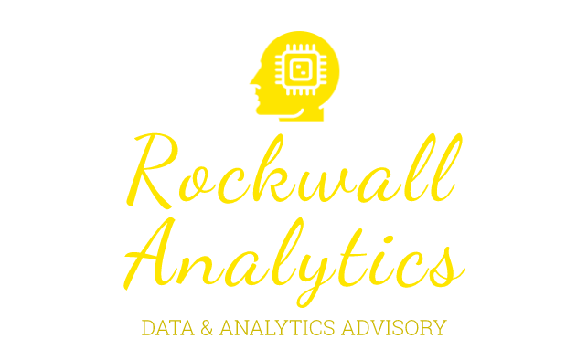

# Big Data
## Analytics, Information & Modelling
## Helps organizations take the mystery out of big data and show them how to leverage their data resources to produce better business outcomes
## Aug 10, 2020
## Authors RIHAD, SAMIRA, SALENA

## Data, Analytics & Modelling
Our team helps organisations take the mystery out of big data and demonstrates how to leverage data resources to produce better business outcomes.

Organisations of today need to better leverage data resources to create value, enhance competitiveness and drive business decisions.

Leaders must take a 360° view of the extraordinary volume of data available – historic, current and predictive – so they can extract what they need and make new discoveries.

KPMG’s Data, Analytics & Modelling service helps take the mystery out of big data, working with organisations to leverage data resources and produce better business outcomes.

## How we can help
Our approach is based on the proposition that business success depends on what you actually do with your business information, not how much of it you control and collate.

We can give your organisation a holistic view of your data, enabling you to learn from and use it to make better business decisions, grow revenue, enhance operational capabilities, and manage enterprise risks and compliance mandates.

With analytical and technical solutions deeply anchored in industry and functional knowledge, combined with a detailed understanding of our clients' needs, our approaches demystify data management, tackle industry-specific challenge, and cover a range of important business issues.

## We can help you with:
data analytics strategy and roadmap
dashboards and visualisation
execution support
scheduling/optimisation
compliance (controls, fraud)
data monetisation
bespoke models.

## Industry focus
Industries we work with include:

financial services
technology, media and telecommunications
consumer markets
energy and natural resources
healthcare
